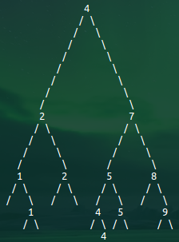
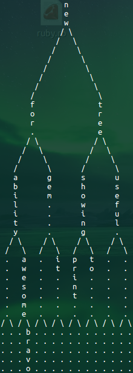

# tree_print

#### A gem for visualizing binary tree data structures in ruby.

##### Works for any node-based implementations where the node responds to the following methods

```ruby
node.left     # returns node object 'on the left'
node.right    # returns node object 'on the right'
node.val      # returns value at that node
node.height   # however many levels above the bottom-most child (leaf) node
              # (leaf nodes are at height 1)
```

Simply pass the head node as an argument to the `TreePrint::tree_to_s` method to convert the whole tree to a nicely formatted, multi-line string. You can include the `TreePrint` module to your class as well.

See examples for integration with a binary search tree class.
Running the `example.rb` in the examples directory produces the following output:





## RubyGems link

[https://rubygems.org/gems/tree_print](https://rubygems.org/gems/tree_print)